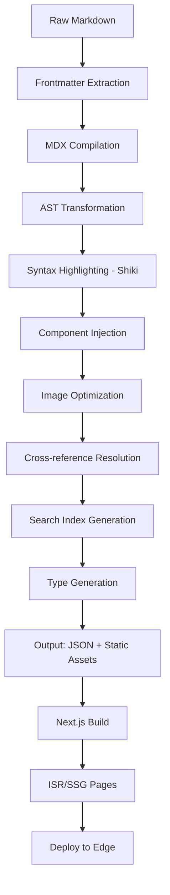

# Power BI Mastery - Enterprise Architecture Document

## Executive Summary

**Project Name:** Power BI Mastery  
**Type:** Enterprise Premium Learning Portal  
**Target Audience:** Power BI Developers, Data Analysts, BI Professionals  
**Content Source:** DAX & M Language documentation (96+ M files, 25+ DAX best practices)  
**Deployment Target:** Production-ready, scalable, globally distributed

---

## 1. System Architecture Overview

### 1.1 High-Level Architecture

```
┌─────────────────────────────────────────────────────────────────────────────┐
│                              CLIENT LAYER                                    │
│  ┌─────────────┐  ┌─────────────┐  ┌─────────────┐  ┌─────────────┐        │
│  │   Web App   │  │   PWA       │  │   Mobile    │  │   Desktop   │        │
│  │  (Next.js)  │  │  (Offline)  │  │  Responsive │  │  (Tauri)    │        │
│  └──────┬──────┘  └──────┬──────┘  └──────┬──────┘  └──────┬──────┘        │
└─────────┼────────────────┼────────────────┼────────────────┼───────────────┘
          │                │                │                │
          ▼                ▼                ▼                ▼
┌─────────────────────────────────────────────────────────────────────────────┐
│                            CDN / EDGE LAYER                                  │
│  ┌─────────────────────────────────────────────────────────────────────┐   │
│  │  Cloudflare / Vercel Edge Network                                    │   │
│  │  • Global CDN (300+ PoPs)                                           │   │
│  │  • Edge Functions (Auth, A/B Testing, Geo-routing)                 │   │
│  │  • DDoS Protection, WAF, Bot Management                             │   │
│  │  • Image Optimization (AVIF/WebP, responsive)                       │   │
│  └─────────────────────────────────────────────────────────────────────┘   │
└─────────────────────────────────────────────────────────────────────────────┘
          │
          ▼
┌─────────────────────────────────────────────────────────────────────────────┐
│                         APPLICATION LAYER                                    │
│  ┌─────────────────────────────────────────────────────────────────────┐   │
│  │  Next.js 14 App Router (React 18, Server Components)               │   │
│  │  ┌─────────────┐ ┌─────────────┐ ┌─────────────┐ ┌─────────────┐  │   │
│  │  │  Docs Site  │  │  Playground │  │  Learning   │  │  Community  │  │   │
│  │  │  (MDX/SSG)  │  │  (WASM)     │  │  Paths      │  │  Features   │  │   │
│  │  └─────────────┘ └─────────────┘ └─────────────┘ └─────────────┘  │   │
│  │  ┌─────────────┐ ┌─────────────┐ ┌─────────────┐ ┌─────────────┐  │   │
│  │  │   Auth      │  │  Progress   │  │  Search     │  │  Analytics  │  │   │
│  │  │  (NextAuth) │  │  Tracking   │  │  (Algolia)  │  │  (Vercel)   │  │   │
│  │  └─────────────┘ └─────────────┘ └─────────────┘ └─────────────┘  │   │
│  └─────────────────────────────────────────────────────────────────────┘   │
└─────────────────────────────────────────────────────────────────────────────┘
          │
          ▼
┌─────────────────────────────────────────────────────────────────────────────┐
│                            DATA LAYER                                        │
│  ┌─────────────────┐ ┌─────────────────┐ ┌─────────────────┐               │
│  │  PostgreSQL     │  │  Redis          │  │  Object Storage │               │
│  │  (Neon/Vercel)  │  │  (Upstash)      │  │  (R2/S3)        │               │
│  │  • Users        │  │  • Sessions     │  │  • Assets       │               │
│  │  • Progress     │  │  • Cache        │  │  • PDFs         │               │
│  │  • Bookmarks    │  │  • Rate Limit   │  │  • Exports      │               │
│  │  • Notes        │  │  • Pub/Sub      │  │  • Backups      │               │
│  └─────────────────┘ └─────────────────┘ └─────────────────┘               │
│  ┌─────────────────┐ ┌─────────────────┐                                    │
│  │  Search Index   │  │  Vector DB      │                                    │
│  │  (Algolia/      │  │  (Pinecone/     │                                    │
│  │   Meilisearch)  │  │   pgvector)     │                                    │
│  │  • Full-text    │  │  • AI Search    │                                    │
│  │  • Faceted      │  │  • Embeddings   │                                    │
│  └─────────────────┘ └─────────────────┘                                    │
└─────────────────────────────────────────────────────────────────────────────┘
          │
          ▼
┌─────────────────────────────────────────────────────────────────────────────┐
│                         CONTENT PROCESSING PIPELINE                          │
│  ┌─────────────────────────────────────────────────────────────────────┐   │
│  │  GitHub Actions / Turbo Build Pipeline                              │   │
│  │  • Markdown → MDX → AST → Optimized JSON                            │   │
│  │  • Syntax Highlighting (Shiki)                                      │   │
│  │  • Image Optimization (Sharp)                                       │   │
│  │  • Search Index Generation                                          │   │
│  │  • Type Generation (TypeScript interfaces)                          │   │
│  │  • Sitemap/RSS/JSON Feed Generation                                 │   │
│  │  • PDF Generation (Puppeteer)                                       │   │
│  └─────────────────────────────────────────────────────────────────────┘   │
└─────────────────────────────────────────────────────────────────────────────┘
```

### 1.2 Technology Stack

| Layer | Technology | Version | Rationale |
|-------|------------|---------|-----------|
| **Framework** | Next.js | 14.x (App Router) | React Server Components, Streaming, ISR |
| **Language** | TypeScript | 5.x | Type safety, DX, enterprise adoption |
| **Styling** | Tailwind CSS | 3.x | Utility-first, design system, performance |
| **UI Components** | shadcn/ui + Radix UI | Latest | Accessible, customizable, premium feel |
| **Animations** | Framer Motion | 10.x | Production animations, layout transitions |
| **Content** | MDX + Remark/Rehype | Latest | React in Markdown, extensible |
| **Syntax Highlighting** | Shiki | Latest | VS Code themes, WASM, no runtime deps |
| **Search** | Algolia DocSearch / Meilisearch | Latest | Instant search, faceted, typo-tolerance |
| **Auth** | NextAuth.js | 5.x | Multiple providers, edge-compatible |
| **Database** | PostgreSQL (Neon) | 15+ | Serverless, branching, auto-scaling |
| **Cache** | Redis (Upstash) | 7.x | Serverless, HTTP-based, global |
| **ORM** | Prisma | 5.x | Type-safe, migrations, preview features |
| **Validation** | Zod | 3.x | Schema validation, inference |
| **Forms** | React Hook Form + Zod | Latest | Performant, accessible |
| **State** | Zustand + TanStack Query | Latest | Lightweight, server state management |
| **Testing** | Vitest + Playwright | Latest | Unit, integration, E2E |
| **CI/CD** | GitHub Actions | - | Native, matrix, environments |
| **Container** | Docker | Latest | Reproducible, multi-stage |
| **Deploy** | Vercel / Cloudflare Pages | - | Edge, preview deployments, analytics |
| **Monitoring** | Vercel Analytics + Sentry | - | Real-user monitoring, error tracking |
| **PWA** | next-pwa / Workbox | Latest | Offline, installable, background sync |

---

## 2. Monorepo Structure (Turborepo)

```
power-bi-mastery/
├── .github/
│   ├── workflows/
│   │   ├── ci.yml              # PR checks, typecheck, lint, test
│   │   ├── cd.yml              # Deploy to preview/production
│   │   ├── content-sync.yml    # Sync docs from source repo
│   │   ├── dependency-review.yml
│   │   └── release.yml         # Semantic release
│   └── dependabot.yml
├── .vscode/
│   ├── settings.json
│   ├── extensions.json
│   └── launch.json
├── apps/
│   ├── web/                    # Next.js 14 Application
│   │   ├── src/
│   │   │   ├── app/            # App Router pages
│   │   │   │   ├── (auth)/     # Auth group (login, register)
│   │   │   │   ├── (dashboard)/ # Protected routes
│   │   │   │   ├── (docs)/     # Documentation routes
│   │   │   │   ├── (playground)/ # Code playgrounds
│   │   │   │   ├── api/        # API routes
│   │   │   │   ├── globals.css
│   │   │   │   ├── layout.tsx
│   │   │   │   └── page.tsx
│   │   │   ├── components/     # App-specific components
│   │   │   ├── lib/            # Utilities, configs
│   │   │   ├── hooks/          # Custom hooks
│   │   │   ├── styles/         # Global styles
│   │   │   ├── types/          # TypeScript types
│   │   │   └── content/        # Processed content (generated)
│   │   ├── public/             # Static assets
│   │   ├── next.config.js
│   │   ├── tailwind.config.ts
│   │   ├── tsconfig.json
│   │   ├── package.json
│   │   └── Dockerfile
│   ├── docs-processor/         # Content processing CLI
│   │   ├── src/
│   │   │   ├── index.ts
│   │   │   ├── processors/
│   │   │   ├── transformers/
│   │   │   ├── generators/
│   │   │   └── utils/
│   │   ├── package.json
│   │   └── tsconfig.json
│   └── playground-worker/      # WASM playground workers
│       ├── src/
│       ├── package.json
│       └── wrangler.toml
├── packages/
│   ├── ui/                     # Shared UI component library
│   │   ├── src/
│   │   │   ├── components/
│   │   │   ├── hooks/
│   │   │   ├── utils/
│   │   │   ├── styles/
│   │   │   └── index.ts
│   │   ├── tailwind.config.ts
│   │   ├── package.json
│   │   └── tsconfig.json
│   ├── config/                 # Shared configs
│   │   ├── eslint/
│   │   ├── prettier/
│   │   ├── tailwind/
│   │   ├── typescript/
│   │   └── jest/
│   ├── database/               # Prisma schema & client
│   │   ├── prisma/
│   │   │   ├── schema.prisma
│   │   │   └── migrations/
│   │   ├── src/
│   │   │   ├── client.ts
│   │   │   └── index.ts
│   │   └── package.json
│   ├── auth/                   # Auth configuration
│   │   ├── src/
│   │   │   ├── config.ts
│   │   │   ├── providers/
│   │   │   ├── callbacks/
│   │   │   └── index.ts
│   │   └── package.json
│   ├── search/                 # Search utilities
│   │   ├── src/
│   │   │   ├── index.ts
│   │   │   ├── algolia.ts
│   │   │   ├── meilisearch.ts
│   │   │   └── types.ts
│   │   └── package.json
│   ├── content/                # Content types & utilities
│   │   ├── src/
│   │   │   ├── types.ts
│   │   │   ├── schema.ts       # Zod schemas
│   │   │   ├── transformers.ts
│   │   │   └── index.ts
│   │   └── package.json
│   ├── playground/             # Playground shared logic
│   │   ├── src/
│   │   │   ├── dax/
│   │   │   ├── m/
│   │   │   ├── monaco/
│   │   │   └── index.ts
│   │   └── package.json
│   └── analytics/              # Analytics utilities
│       ├── src/
│       │   ├── events.ts
│       │   ├── providers/
│       │   └── index.ts
│       └── package.json
├── content/                    # Source documentation (git submodule or copied)
│   ├── dax/
│   └── m/
├── tooling/
│   ├── scripts/
│   │   ├── build-docs.ts
│   │   ├── generate-search-index.ts
│   │   ├── generate-sitemap.ts
│   │   ├── generate-pdfs.ts
│   │   └── validate-links.ts
│   └── eslint-rules/
├── docker/
│   ├── Dockerfile.web
│   ├── Dockerfile.processor
│   ├── docker-compose.yml
│   ├── docker-compose.prod.yml
│   └── .dockerignore
├── turbo.json
├── package.json
├── pnpm-workspace.yaml
├── tsconfig.base.json
├── .eslintrc.js
├── .prettierrc
├── .env.example
├── .gitignore
├── README.md
├── CONTRIBUTING.md
├── LICENSE
└── ARCHITECTURE.md (this file)
```

---

## 3. Content Processing Pipeline

### 3.1 Input Sources

```
Source: query-languages/
├── dax/
│   ├── best-practices/*.md (12 files)
│   ├── includes/*.md (12 files)
│   └── media/ (images)
└── m/
    ├── *.md (96 files)
    ├── media/ (images)
    ├── index.yml (navigation)
    └── toc.yml (table of contents)
```

### 3.2 Processing Stages



### 3.3 Content Models

```typescript
// packages/content/src/types.ts

interface DocFrontmatter {
  title: string;
  description: string;
  category: 'dax' | 'm';
  subcategory?: string;
  tags: string[];
  difficulty: 'beginner' | 'intermediate' | 'advanced';
  estimatedReadTime: number;
  lastUpdated: string;
  authors: string[];
  relatedTopics: string[];
  prerequisites?: string[];
  learningObjectives?: string[];
}

interface ProcessedDoc {
  slug: string;
  frontmatter: DocFrontmatter;
  content: string;           // MDX content
  toc: TocItem[];
  codeBlocks: CodeBlock[];
  images: ImageAsset[];
  readingTime: number;
  wordCount: number;
  headings: Heading[];
}

interface TocItem {
  level: 1 | 2 | 3 | 4;
  text: string;
  slug: string;
  children: TocItem[];
}

interface CodeBlock {
  language: 'dax' | 'm' | 'sql' | 'json' | 'text';
  code: string;
  filename?: string;
  highlightLines?: number[];
  editable: boolean;
  runnable: boolean;
}

interface LearningPath {
  id: string;
  title: string;
  description: string;
  category: 'dax' | 'm' | 'full';
  level: 'beginner' | 'intermediate' | 'advanced' | 'expert';
  estimatedHours: number;
  modules: LearningModule[];
  prerequisites: string[];
  outcomes: string[];
}

interface LearningModule {
  id: string;
  title: string;
  description: string;
  docs: string[];           // doc slugs
  exercises: Exercise[];
  quiz?: Quiz;
  estimatedMinutes: number;
}

interface Exercise {
  id: string;
  type: 'code' | 'multiple-choice' | 'fill-blank' | 'debug';
  title: string;
  description: string;
  starterCode?: string;
  solution: string;
  hints: string[];
  testCases?: TestCase[];
}

interface UserProgress {
  userId: string;
  pathId: string;
  moduleId: string;
  status: 'not-started' | 'in-progress' | 'completed';
  startedAt: Date;
  completedAt?: Date;
  exerciseScores: Record<string, number>;
  timeSpent: number;        // seconds
  notes: UserNote[];
  bookmarks: Bookmark[];
}
```

---

## 4. Feature Architecture

### 4.1 Documentation Site (Core)

| Feature | Implementation | Priority |
|---------|---------------|----------|
| **MDX Rendering** | Next.js MDX Remote + custom components | P0 |
| **Syntax Highlighting** | Shiki (WASM) with DAX/M grammars | P0 |
| **Table of Contents** | Auto-generated, sticky, scroll-spy | P0 |
| **Code Copy/Run** | Clipboard API + Playground integration | P0 |
| **Dark/Light Theme** | CSS variables + next-themes | P0 |
| **Responsive Design** | Mobile-first, breakpoint-aware | P0 |
| **Search** | Algolia DocSearch + local Meilisearch fallback | P0 |
| **PDF Export** | Puppeteer serverless function | P1 |
| **Offline Support** | Service Worker + Workbox | P1 |
| **Reading Progress** | LocalStorage + sync to backend | P1 |
| **Annotations/Notes** | Inline comments, highlights | P2 |
| **Versioning** | Git-based version selector | P2 |

### 4.2 Interactive Playgrounds

| Feature | DAX Playground | M Playground |
|---------|----------------|--------------|
| **Engine** | WebAssembly (custom) | Power Query M WASM (if available) / Simulator |
| **Editor** | Monaco Editor | Monaco Editor |
| **IntelliSense** | Custom DAX language service | Custom M language service |
| **Schema Awareness** | Sample model (Adventure Works) | Sample tables |
| **Execution** | Client-side WASM | Serverless function (security) |
| **Results** | Table/Chart visualization | Table preview |
| **Sharing** | URL-encoded state | URL-encoded state |
| **Templates** | Common patterns | Common patterns |

### 4.3 Learning Management

```
Learning Paths:
├── DAX Fundamentals (Beginner, 8h)
│   ├── Variables & Measures
│   ├── Filter Context
│   ├── CALCULATE Mastery
│   └── Time Intelligence
├── DAX Advanced (Intermediate, 12h)
│   ├── Iterator Functions
│   ├── Advanced Filter Context
│   ├── Performance Tuning
│   └── DAX Studio Integration
├── M Language Fundamentals (Beginner, 10h)
│   ├── Let Expressions & Values
│   ├── Data Types & Conversion
│   ├── List/Record/Table Functions
│   └── Error Handling
├── M Language Advanced (Intermediate, 15h)
│   ├── Custom Functions
│   ├── Data Source Connectors
│   ├── Performance & Folding
│   └── M Spec Deep Dive
└── End-to-End BI (Expert, 20h)
    ├── Data Modeling
    ├── DAX + M Integration
    ├── Deployment Pipelines
    └── Governance & Security
```

### 4.4 Community & Social

- **Discussions:** GitHub Discussions integration
- **Code Sharing:** Gist-like snippets with versioning
- **Challenges:** Weekly DAX/M challenges with leaderboards
- **Certificates:** Completion certificates with verification
- **Mentorship:** Expert-learner matching (future)

---

## 5. Security Architecture

### 5.1 Authentication & Authorization

```typescript
// Auth Providers
- Email/Password (with magic links)
- OAuth: GitHub, Microsoft, Google, LinkedIn
- Enterprise: SAML/OIDC (future)
- MFA: TOTP, WebAuthn

// Authorization Model (RBAC)
roles:
  - anonymous: Read public docs, search
  - learner: Track progress, bookmarks, notes, playground
  - contributor: Submit corrections, discussions
  - expert: Verified badge, mentor access
  - admin: Full access, analytics, content management
```

### 5.2 Security Measures

| Layer | Measures |
|-------|----------|
| **Network** | WAF, DDoS, Rate limiting (Upstash), CSP headers |
| **Application** | Input validation (Zod), XSS prevention, CSRF tokens |
| **Data** | Encryption at rest (AES-256), TLS 1.3 in transit |
| **Secrets** | 1Password/Vault, never in code, rotation policy |
| **Dependencies** | Dependabot, Snyk, license scanning |
| **Code** | SAST (CodeQL), signed commits, SBOM generation |

---

## 6. Performance Strategy

### 6.1 Core Web Vitals Targets

| Metric | Target | Measurement |
|--------|--------|-------------|
| **LCP** | < 2.0s | Vercel Analytics / Lighthouse |
| **FID/INP** | < 100ms | Real User Monitoring |
| **CLS** | < 0.1 | Layout shift monitoring |
| **TTFB** | < 200ms | Edge caching |
| **LCP (docs)** | < 1.5s | Static generation |

### 6.2 Optimization Techniques

- **Static Generation:** All doc pages pre-rendered at build
- **ISR:** 60s revalidation for dynamic content
- **Streaming:** React 18 Suspense boundaries
- **Code Splitting:** Route-based + component-based
- **Image Optimization:** Next/Image + Cloudflare Images
- **Font Optimization:** Self-hosted variable fonts (Inter, JetBrains Mono)
- **Bundle Analysis:** @next/bundle-analyzer in CI
- **Performance Budget:** 150KB JS, 50KB CSS initial

---

## 7. DevOps & Deployment

### 7.1 Environments

| Environment | Purpose | URL | Deploy Trigger |
|-------------|---------|-----|----------------|
| **Local** | Development | localhost:3000 | `pnpm dev` |
| **Preview** | PR validation | `pr-XXX.vercel.app` | Push to branch |
| **Staging** | QA, UAT | `staging.powerbimastery.com` | Merge to `develop` |
| **Production** | Live | `powerbimastery.com` | Merge to `main` / Tag |

### 7.2 CI/CD Pipeline

```yaml
# .github/workflows/ci.yml
stages:
  1. Lint & Typecheck (pnpm lint, pnpm typecheck)
  2. Unit Tests (vitest --coverage)
  3. Build (turbo run build)
  4. Integration Tests (playwright)
  5. E2E Tests (playwright --project=chromium)
  6. Performance Budget (lighthouse-ci)
  7. Security Scan (codeql, snyk)
  8. Docker Build (multi-stage)
  9. Deploy Preview (Vercel)

# .github/workflows/cd.yml
production:
  - Requires: approval, all checks pass
  - Blue/Green deploy via Vercel
  - Smoke tests post-deploy
  - Rollback on error rate > 1%
```

### 7.3 Infrastructure as Code

```dockerfile
# docker/Dockerfile.web (multi-stage)
FROM node:20-alpine AS base
FROM base AS builder
  # Install deps, build
FROM base AS runner
  # Copy built assets, non-root user
  # Health checks, signal handling
```

---

## 8. Monitoring & Observability

### 8.1 Metrics Collection

| Category | Tool | Key Metrics |
|----------|------|-------------|
| **Real User** | Vercel Analytics + Web Vitals | LCP, FID, CLS, FCP, TTFB |
| **Application** | Sentry | Errors, transactions, adoption |
| **Business** | Custom Events (Plausible/GA4) | Signups, completions, searches |
| **Infrastructure** | Vercel/Cloudflare | Bandwidth, requests, edge latency |
| **Database** | Neon/Upstash | Connections, query latency, cache hit |

### 8.2 Alerting Rules

```yaml
alerts:
  - name: high-error-rate
    condition: error_rate > 1% for 5m
    severity: critical
    channels: [pagerduty, slack]
  
  - name: slow-docs-page
    condition: p95_latency > 3s for 10m
    severity: warning
    channels: [slack]
  
  - name: search-failures
    condition: search_error_rate > 5%
    severity: critical
    channels: [pagerduty, slack]
  
  - name: build-failure
    condition: ci_failed
    severity: warning
    channels: [slack, email]
```

---

## 9. Accessibility (WCAG 2.1 AA)

- **Semantic HTML:** Proper heading hierarchy, landmarks
- **Keyboard Navigation:** Focus visible, skip links, trap focus
- **Screen Readers:** ARIA labels, live regions, alt text
- **Color Contrast:** 4.5:1 minimum, 7:1 for AAA text
- **Motion:** Respect `prefers-reduced-motion`
- **Testing:** axe-core in CI, manual testing with NVDA/JAWS

---

## 10. Internationalization (Future)

```
locales/
├── en/ (default)
├── es/
├── fr/
├── de/
├── ja/
├── zh-CN/
└── pt-BR/

Strategy: next-intl with route-based locale detection
```

---

## 11. Risk Assessment & Mitigation

| Risk | Likelihood | Impact | Mitigation |
|------|------------|--------|------------|
| Content sync drift | Medium | High | Automated sync pipeline, checksums |
| WASM playground performance | Medium | Medium | Fallback to server execution |
| Search index staleness | Low | Medium | Incremental updates, webhook triggers |
| Database costs at scale | Low | High | Connection pooling, read replicas |
| Auth provider outage | Low | High | Multiple providers, email fallback |
| Image storage costs | Medium | Medium | Cloudflare Images, aggressive caching |

---

## 12. Implementation Phases

### Phase 1: Foundation (Weeks 1-3)
- [ ] Monorepo setup, CI/CD, Docker
- [ ] Database schema, auth, base UI kit
- [ ] Content processor MVP (markdown → JSON)
- [ ] Doc site with MDX, search, theme

### Phase 2: Core Features (Weeks 4-6)
- [ ] Full DAX/M documentation site
- [ ] Syntax highlighting, code playgrounds (basic)
- [ ] Learning paths, progress tracking
- [ ] PWA, offline, PDF export

### Phase 3: Premium Features (Weeks 7-9)
- [ ] Advanced playground (IntelliSense, schema)
- [ ] AI-powered search (vector embeddings)
- [ ] Community features, challenges
- [ ] Certificates, analytics dashboard

### Phase 4: Enterprise Polish (Weeks 10-12)
- [ ] Performance optimization, load testing
- [ ] Security audit, penetration testing
- [ ] Accessibility audit, WCAG certification
- [ ] Documentation, runbooks, handoff

---

## 13. Success Metrics

| KPI | Target | Measurement |
|-----|--------|-------------|
| **Monthly Active Users** | 10,000+ | Auth events |
| **Doc Page Views** | 100,000+/mo | Analytics |
| **Learning Path Completion** | 25% | Progress tracking |
| **Playground Sessions** | 5,000+/mo | Event tracking |
| **Search Success Rate** | > 80% | Click-through |
| **NPS Score** | > 50 | Quarterly survey |
| **Uptime** | 99.9% | Vercel/Cloudflare SLA |
| **Page Load (p95)** | < 2s | RUM |

---

## 14. Appendix: Key Decisions Log

| Decision | Date | Rationale |
|----------|------|-----------|
| Next.js App Router | 2024 | RSC, streaming, best DX for content sites |
| Turborepo | 2024 | Incremental builds, caching, task orchestration |
| PostgreSQL (Neon) | 2024 | Serverless, branching, cost-effective |
| Shiki over Prism | 2024 | VS Code themes, WASM, no flash |
| Algolia + Meilisearch | 2024 | Best DX + self-hosted fallback |
| pnpm | 2024 | Fast, disk-efficient, strict hoisting |
| TypeScript strict | 2024 | Catch bugs early, better refactoring |

---

*Document Version: 1.0*  
*Last Updated: 2024*  
*Author: Senior Architecture Team*